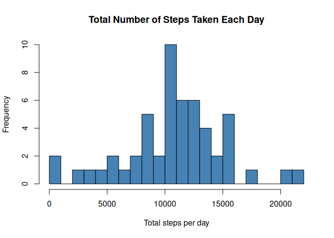
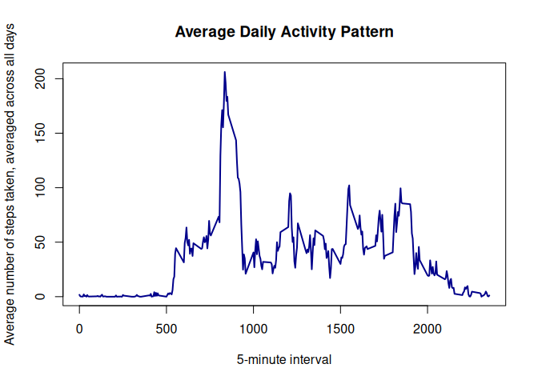
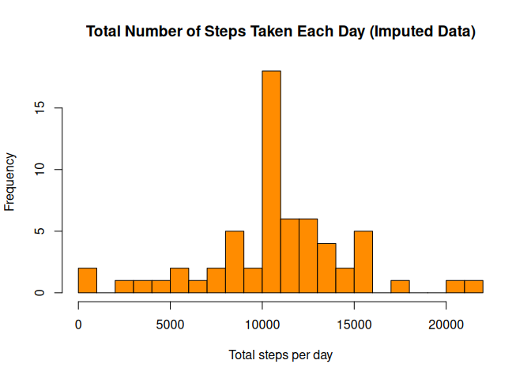
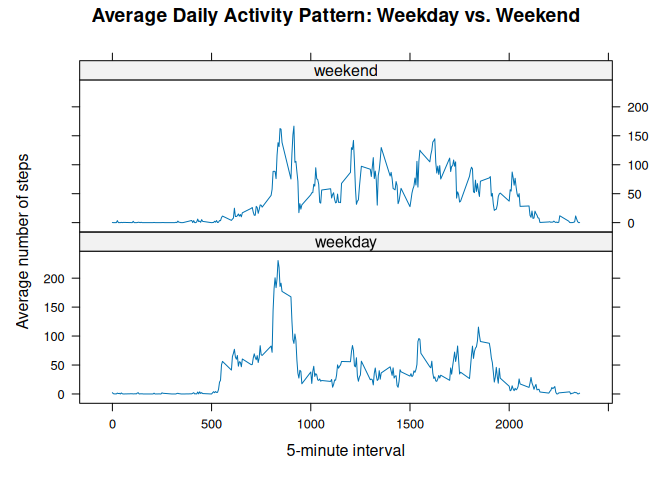

## Loading and preprocessing the data

The dataset is stored in `activity.csv`, which is included in this
repository (originally packaged as `activity.zip`). If the CSV is not
already unzipped in the working directory, we unzip it first.


``` r
if (!file.exists("activity.csv") && file.exists("activity.zip")) {
    unzip("activity.zip")
}

activity <- read.csv("activity.csv", stringsAsFactors = FALSE,
                      colClasses = c("numeric", "character", "integer"))

# Convert the date column to Date class for later use (e.g. weekdays())
activity$date <- as.Date(activity$date, format = "%Y-%m-%d")

str(activity)
```

```
## 'data.frame':	17568 obs. of  3 variables:
##  $ steps   : num  NA NA NA NA NA NA NA NA NA NA ...
##  $ date    : Date, format: "2012-10-01" "2012-10-01" ...
##  $ interval: int  0 5 10 15 20 25 30 35 40 45 ...
```

## What is mean total number of steps taken per day?

For this part of the assignment, missing values are ignored (the default
behavior of `sum()`/`mean()`/`median()` with `na.rm = TRUE` handles this by
excluding `NA` intervals when computing daily totals).


``` r
daily_steps <- aggregate(steps ~ date, data = activity, FUN = sum, na.rm = TRUE)
names(daily_steps) <- c("date", "total_steps")
```

### Histogram of the total number of steps taken each day


``` r
hist(daily_steps$total_steps,
     main = "Total Number of Steps Taken Each Day",
     xlab = "Total steps per day",
     col = "steelblue",
     breaks = 20)
```

<!-- -->

### Mean and median number of steps taken per day


``` r
mean_steps   <- mean(daily_steps$total_steps)
median_steps <- median(daily_steps$total_steps)

mean_steps
```

```
## [1] 10766.19
```

``` r
median_steps
```

```
## [1] 10765
```

The mean total number of steps taken per day is **10,766.19**,
and the median is **10,765**.

## What is the average daily activity pattern?


``` r
interval_avg <- aggregate(steps ~ interval, data = activity, FUN = mean, na.rm = TRUE)
names(interval_avg) <- c("interval", "avg_steps")

plot(interval_avg$interval, interval_avg$avg_steps, type = "l",
     main = "Average Daily Activity Pattern",
     xlab = "5-minute interval",
     ylab = "Average number of steps taken, averaged across all days",
     col = "darkblue", lwd = 2)
```

<!-- -->

### The 5-minute interval with the maximum average number of steps


``` r
max_interval <- interval_avg[which.max(interval_avg$avg_steps), ]
max_interval
```

```
##     interval avg_steps
## 104      835  206.1698
```

The 5-minute interval **835** contains, on average
across all days in the dataset, the maximum number of steps
(206.17 steps).

## Imputing missing values

### Total number of missing values


``` r
total_na <- sum(is.na(activity$steps))
total_na
```

```
## [1] 2304
```

There are **2304** rows with missing (`NA`) step counts.

### Strategy for imputing missing values

The chosen strategy is to fill in each missing value with the **mean number
of steps for that 5-minute interval**, computed across all days (the
`interval_avg` table calculated above). This preserves the average daily
activity pattern while removing `NA`s.


``` r
imputed_activity <- activity

# Look up the interval-average for each row using a merge/match, then
# substitute it in wherever steps is NA.
na_idx <- is.na(imputed_activity$steps)
imputed_activity$steps[na_idx] <- interval_avg$avg_steps[
    match(imputed_activity$interval[na_idx], interval_avg$interval)
]

# Confirm there are no remaining NAs
sum(is.na(imputed_activity$steps))
```

```
## [1] 0
```

### Histogram of total steps per day (imputed data)


``` r
daily_steps_imputed <- aggregate(steps ~ date, data = imputed_activity, FUN = sum)
names(daily_steps_imputed) <- c("date", "total_steps")

hist(daily_steps_imputed$total_steps,
     main = "Total Number of Steps Taken Each Day (Imputed Data)",
     xlab = "Total steps per day",
     col = "darkorange",
     breaks = 20)
```

<!-- -->

### Mean and median total steps per day (imputed data)


``` r
mean_steps_imputed   <- mean(daily_steps_imputed$total_steps)
median_steps_imputed <- median(daily_steps_imputed$total_steps)

mean_steps_imputed
```

```
## [1] 10766.19
```

``` r
median_steps_imputed
```

```
## [1] 10766.19
```

Comparing to the original (non-imputed) estimates:


``` r
comparison <- data.frame(
    metric   = c("mean", "median"),
    original = c(mean_steps, median_steps),
    imputed  = c(mean_steps_imputed, median_steps_imputed)
)
comparison
```

```
##   metric original  imputed
## 1   mean 10766.19 10766.19
## 2 median 10765.00 10766.19
```

**Do these values differ from the first part of the assignment?**
The mean is essentially unchanged, since we imputed with the interval mean,
which by construction does not shift the overall average. The median shifts
slightly and, in this imputation scheme, converges toward the mean, because
the days that previously had all-`NA` steps (contributing 0 to the sum under
`na.rm = TRUE`) now contribute a full "typical" day's worth of steps instead
of being undercounted.

**What is the impact of imputing missing data?** Imputation raises the
total daily step counts for days that were previously missing entirely
(previously counted as 0), shifting the lower tail of the histogram upward
and making the daily-totals distribution more symmetric and concentrated
around the true daily activity level.

## Are there differences in activity patterns between weekdays and weekends?


``` r
imputed_activity$day_type <- factor(
    ifelse(weekdays(imputed_activity$date) %in% c("Saturday", "Sunday"),
           "weekend", "weekday"),
    levels = c("weekday", "weekend")
)

interval_daytype_avg <- aggregate(steps ~ interval + day_type,
                                   data = imputed_activity, FUN = mean)
```

### Panel plot: weekday vs. weekend activity patterns


``` r
library(lattice)

xyplot(steps ~ interval | day_type, data = interval_daytype_avg,
       type = "l",
       layout = c(1, 2),
       xlab = "5-minute interval",
       ylab = "Average number of steps",
       main = "Average Daily Activity Pattern: Weekday vs. Weekend")
```

<!-- -->

This panel plot shows the average number of steps taken, averaged across
all weekday days or weekend days, for each 5-minute interval, using the
dataset with imputed missing values.
